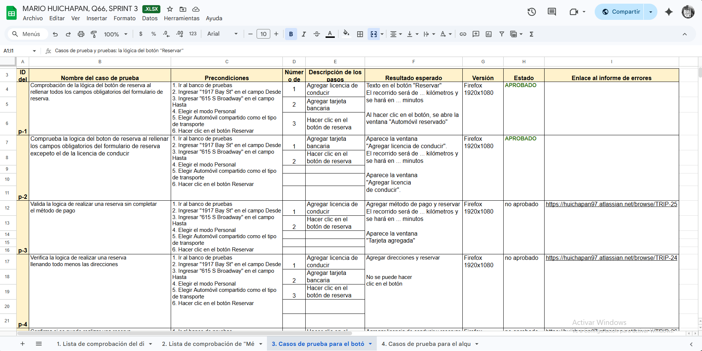
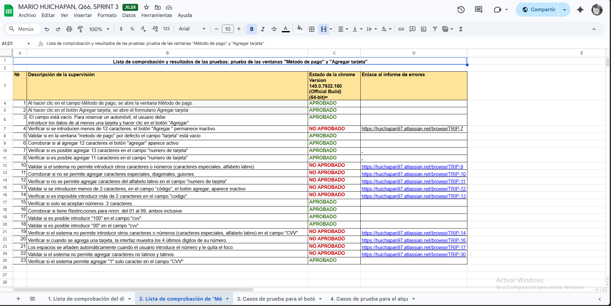

# 🌐 Web Testing – Functional Testing Project

Proyecto enfocado en pruebas funcionales de una aplicación web, validando flujos de usuario y detectando errores en la interfaz y lógica del sistema.

---

## 📌 Objetivo
Asegurar el correcto funcionamiento de la aplicación web mediante la ejecución de pruebas manuales sobre funcionalidades críticas del usuario.

---

## 🧪 Scope de pruebas
- Pruebas de UI (interfaz de usuario)
- Validación de formularios (login, registro)
- Pruebas de navegación entre páginas
- Verificación de mensajes de error
- Pruebas de flujo completo (end-to-end)

---

## 🛠️ Herramientas utilizadas
- Navegador web (Chrome)
- Chrome DevTools
- Jira (gestión de bugs)
- Test case design

---

## 📋 Actividades realizadas
- Diseño de casos de prueba
- Ejecución de pruebas manuales
- Identificación y documentación de bugs
- Validación de resultados esperados vs reales

---

## 📸 Evidencia

### 🔹 Casos de prueba en navegador

### 🔹 Comprobación de funcionalidades

### 🔹 Lista de comprobación (checklist)

---

## 💡 Resultados
- Identificación de errores en validación de formularios
- Detección de fallos en navegación
- Mejora en la experiencia del usuario

---

## 📈 Lo que demuestra este proyecto
- Capacidad de testing funcional
- Análisis de comportamiento de usuario
- Detección de errores en frontend
- Documentación profesional de pruebas

---

## 👨‍💻 Autor
Mario Huichapan  
QA Engineer (en formación)

---
